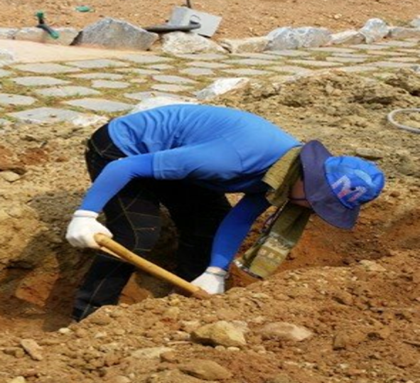
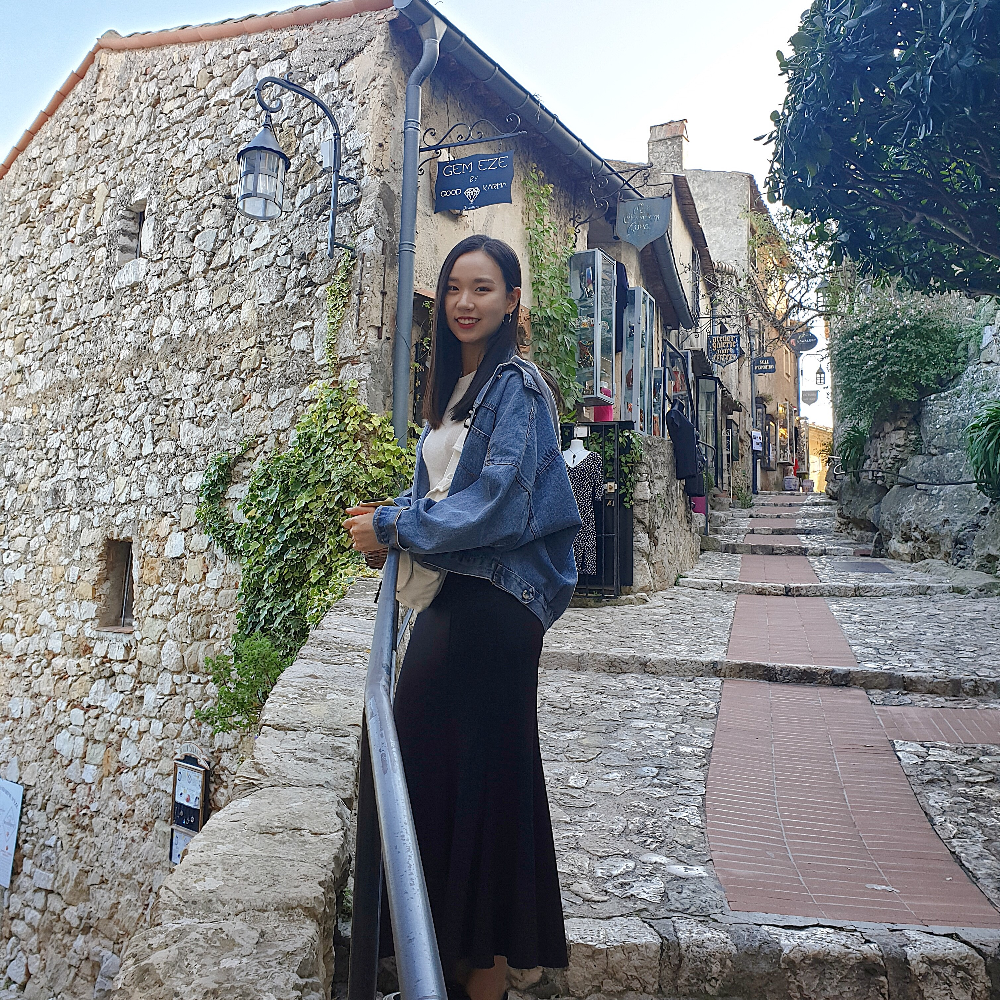
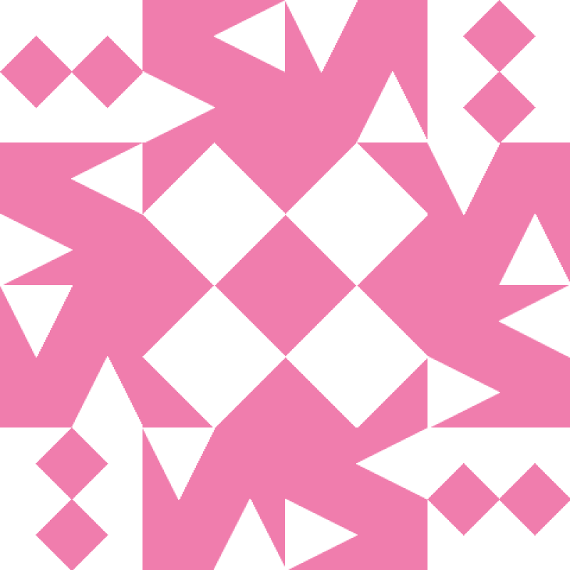
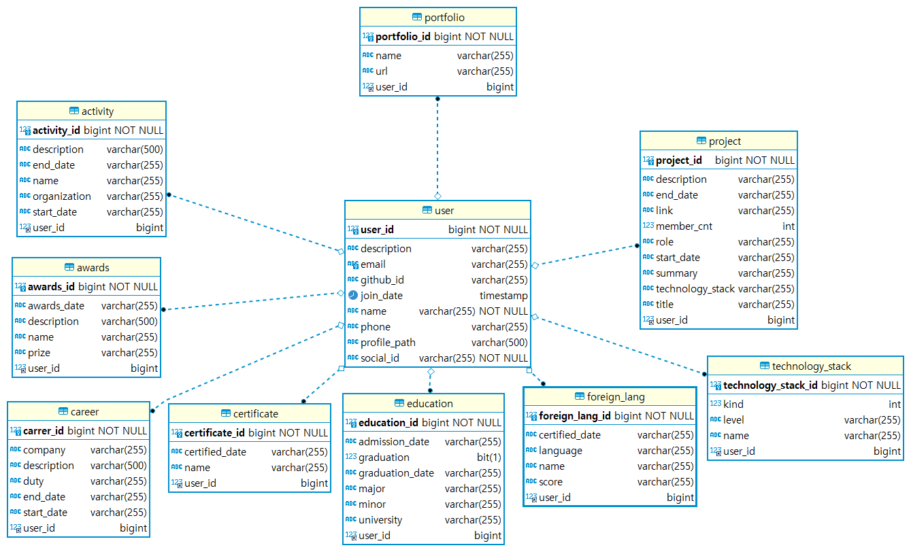
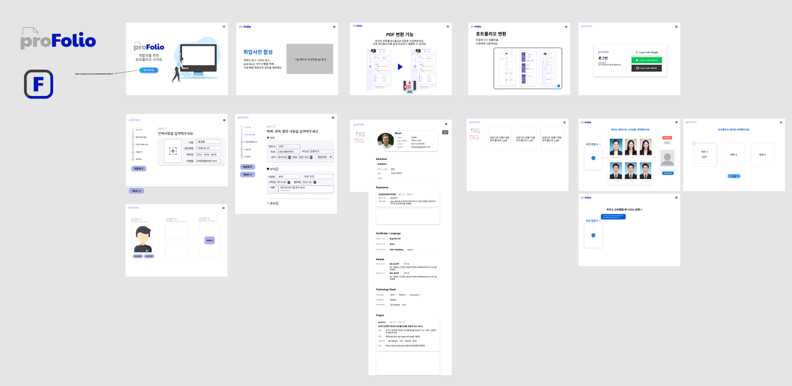
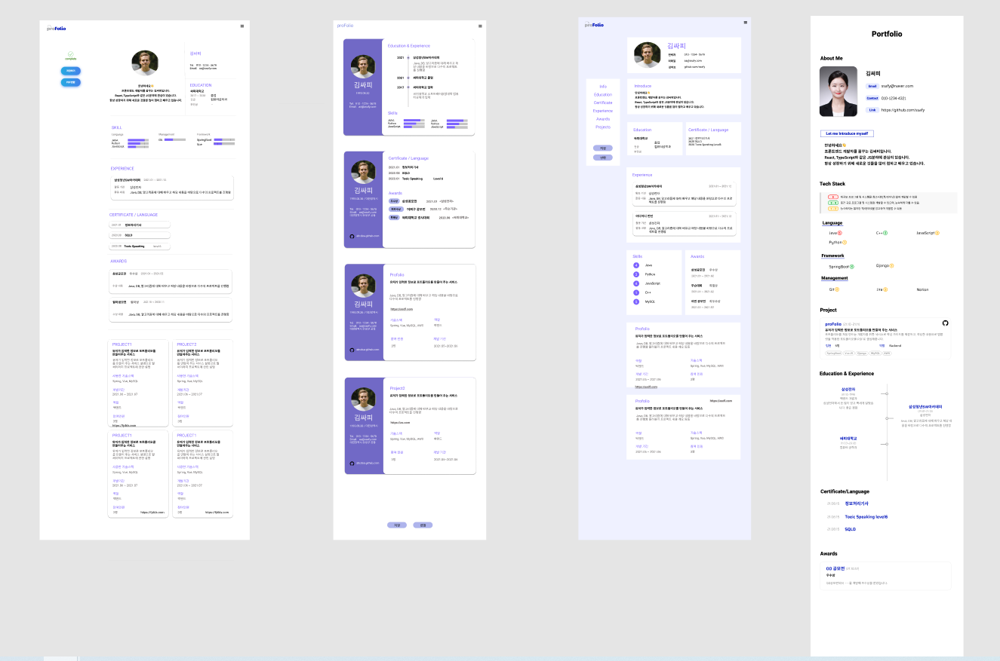
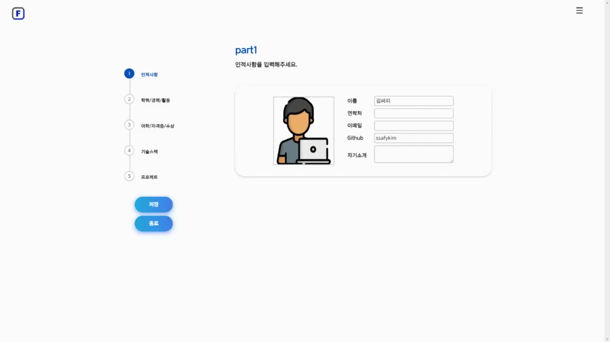
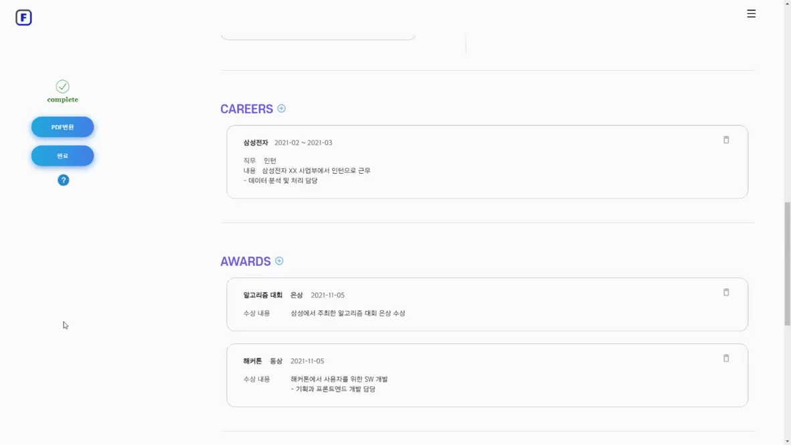

# proFolio | 프로폴리오 📝

- #### 서비스명 : proFolio 프로폴리오
- #### 개발기간 : 2021.10.12 ~ 2021.11.19 (6주)
- #### 팀명 : 알잘딱깔쓴
  - ##### "✍ 알아서 잘 딱 깔끔하게 쓴 포트폴리오"

<br>

# ◽서비스 URL

https://k5b302.p.ssafy.io/

❌ 서비스 이용 불가능


<br>

# 📌서비스 소개

### proFolio란?

- IT 입문자들을 위한 포트폴리오 작성 가이드를 제공하는 웹 서비스
- 본인의 이력(학력, 자격증, 프로젝트 내용 등)을 작성한 후, 테마를 선택하면 포트폴리오로 변환해주는 서비스 제공
- 취업 사진이 없는 지원자를 위한 취업용 사진 합성 서비스 제공
  <br>

### 기획배경

- 최근 개발자의 실력과 경험을 파악하기 위해 포트폴리오 제출을 요구하는 기업이 늘어남에 따라 지원자는 경쟁력 있고 완성도가 높은 포트폴리오를 구성해야 한다.
- IT 입문자들이나 포트폴리오 작성 경험이 없는 지원자들은 포트폴리오 작성법, 들어가야 하는 내용을 잘 알지 못해 어려움을 겪고 있어 프로폴리오 서비스를 기획하게 되었다.
- 포트폴리오 서비스 뿐만 아니라 취업에 필요한 취업용 사진 합성 서비스를 제공한다.

<br>

# 👩 팀원 역할

| Name     |                   이수정                   |                    고동건                    |                   김하정                   |                 엄재식                 |                  전혜민                  |                   최정은                    |
| -------- | :----------------------------------------: | :------------------------------------------: | :----------------------------------------: | :------------------------------------: | :--------------------------------------: | :-----------------------------------------: |
| Profile  |       |         |       |   |     |        |
| Position | Project leader <br />Backend <br /> DevOps |        Full Stack<br />사진 합성 기능        |             Full Stack<br />QA             |                Frontend                |                Full Stack                |                  Frontend                   |
| Github   |  [@SuJeong2](https://github.com/SuJeong2)  | [@dongjuk157](https://github.com/dongjuk157) | [@hajungkim](https://github.com/hajungkim) | [@jaesikk](https://github.com/jaesikk) | [@hyeyemin](https://github.com/hyeyemin) | [@wish4517](https://lab.ssafy.com/wish4517) |

<br>

# 💻 기술 스택

> ### Front : Vue.js
>
> ### Back : Spring, Django
>
> ### Devops : docker, jenkins, nginx
>
> ### Server : AWS, S3
>
> ### DB : MySQL

<br>

# ✔ 아키텍쳐 구조


<br>

# 📝개발 규칙및 문서

<details>
  <summary>Git 규칙</summary>

#### ✔ Branch 규칙

### `develop -> BE,FE/feat/기능명`

#### ex) FE/feat/editor

  <br>

#### ✔ Commit 규칙

### `[ FE / BE / DEV ] [Git 컨벤션(대문자)] Commit 메시지`

#### ex) [FE] [feat] education API연결

<br><br>

</details>
<details>
  <summary>Naming Rule</summary>

| 프론트엔드 | 백엔드                                                                                                                                     |
| ---------- | ------------------------------------------------------------------------------------------------------------------------------------------ |
|            | 클래스명 : 첫글자 대문자 + Camel case<br>변수 : 첫글자 소문자 + Camel case<br>함수명 : save, find, update, delete + 엔티티이름(Camel case) |

</details>

<details>
  <summary>🗂 패키지 구조</summary>

- #### [Frontend](https://melodious-can-b87.notion.site/Frontend-9631e4ceab8c45eb930e285f4f177369)

- #### [Backend](https://melodious-can-b87.notion.site/Backend-b26e89cc1d60412e8d472b1dd1e55879)

</details>

<details>
  <summary>공통 Response,Exception 문서</summary>

- #### [공통 Response,Exception](https://melodious-can-b87.notion.site/Response-Exception-88fe96c63dbc4d7d8872d3329e35cbe2)

</details>

<br>

# 📄 산출물

<details>
  <summary>ERD</summary>  

  

</details>

<details>
  <summary>와이어프레임</summary>

<h2> 🖋[와이어프레임-Figma](https://www.figma.com/file/1bm6o7RuBk8LUyhs1fNV2D/자율PJT?node-id=0%3A1) </h2>





</details>

<details>
  <summary>기능명세서</summary>  
  <h2> 📝[기능명세서](https://melodious-can-b87.notion.site/c5c18834764a4d0bb76648103f079cb1) </h2>
</details>
<br>

# 📑 포팅매뉴얼

```
exec/포팅매뉴얼.md
```

> 소스코드 클론 이후 빌드 및 배포 방법  
> 사용한 IDE 버전과 기술스택 정보  
> 프로젝트에 사용된 외부 서비스

<br>
<br>

# 💻 구현

### [메인화면]


> 메인페이지에서는 프로폴리오가 제공하는 서비스를 확인할 수 있습니다.

<br><br>

### [로그인]


> 많은 사람들이 사용하는 구글, 네이버 소셜 로그인을 지원하고,  
> 개발자를 위해 깃허브 계정 로그인을 지원합니다.

<br><br>

### [이력서 작성 및 수정]


- 이력서 작성
  > 단계에 맞춰 포트폴리오에 들어갈 내용을 작성합니다.  
  > 포트폴리오에 어떤 내용을 넣어야할지 모르는 IT 입문자들 혹은 포트폴리오를 처음 작성해보는 분들도 쉽게 작성이 가능합니다.

<br>

<details>
  <summary>part.1 - 인적사항</summary>



> 이름, 연락처, 이메일, Github아이디, 자기소개를 입력합니다.

</details>
<details>
  <summary>part.2 - 학력,경력,경험</summary>


> 학력, 경력, 경험 내용을 입력합니다.

</details>
<details>
  <summary>part.3 - 어학,성적,수상</summary>


> 어학 성적, 자격증, 수상 경험을 입력합니다.

</details>
<details>
  <summary>part.4 - 기술스택</summary>


> Language, Management, Framework 본인 기술 스택을 입력합니다.

</details>
<details>
  <summary>part.5 - 프로젝트</summary>


> 프로젝트 내용을 입력합니다.

</details>

<br>


- 이력서 수정
  
  > 삭제하고 싶은 내용이 있거나 고쳐야할 부분이 있다면 '이력서 수정'을 통해서 가능합니다.

<br><br>

### [마이페이지]


> 작성을 완료하면 마이페이지에서 작성한 내용을 확인할 수 있습니다.

<br><br>

### [포트폴리오]

- 프로폴리오는 3가지의 테마를 제공합니다.
- 이력서 작성 후, 원하는 테마를 선택하면 이력서 내용에 맞춰 포트폴리오로 변환해줍니다.
- 변환된 포트폴리오 내용의 위치를 바꿀 수 있고, 내용을 추가하거나 삭제할 수 있습니다.

<br>

#### 1. 변환 기능


> 포트폴리오 생성을 누르면 테마를 선택할 수 있습니다.  
> 테마를 선택하면 이력서 내용에 맞춰 포트폴리오로 변환됩니다.

<br><br>

#### 2. 편집 기능



- 위치 변경
  
  > 내용의 위치를 드래그로 변경할 수 있습니다.

<br>


- 내용 삭제 및 추가
  
  > 편집 버튼을 눌러서, 내용을 삭제하거나 다시 추가할 수 있습니다.

<br><br>

### [pdf변환]


> 편집을 마친 포트폴리오를 pdf로 변환하여 저장할 수 있습니다.

<br><br>

### [포트폴리오 리스트]


> 마이페이지의 'My portfolio'에 들어가면 이때까지 만든 포트폴리오 목록을 확인할 수 있습니다.

<br><br>

### [취업사진 합성 기능]


> 사진을 업로드한 후 원하는 헤어스타일, 옷과 배경을 선택하면 취업용 증명 사진으로 변환이 가능합니다.

<br><br>

